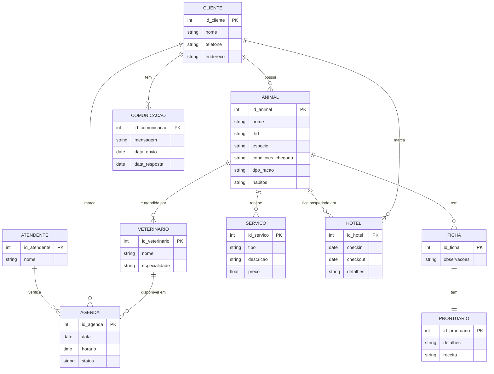
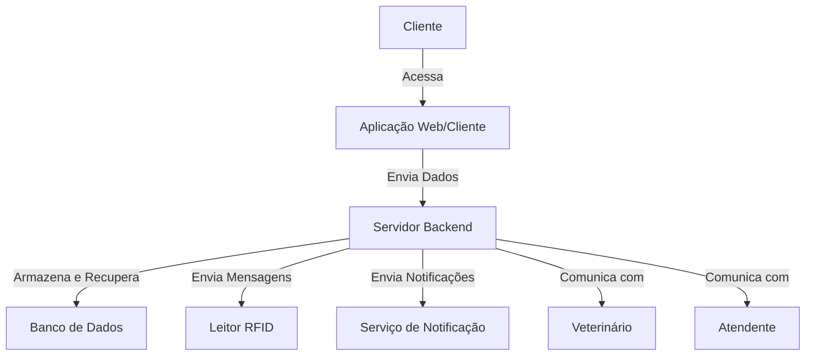
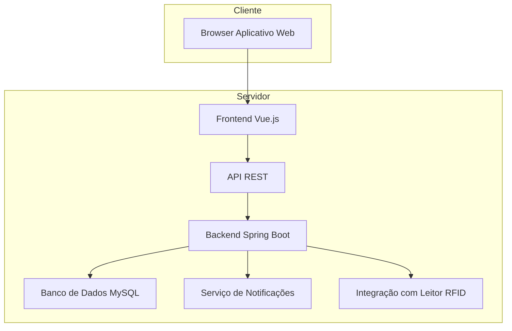
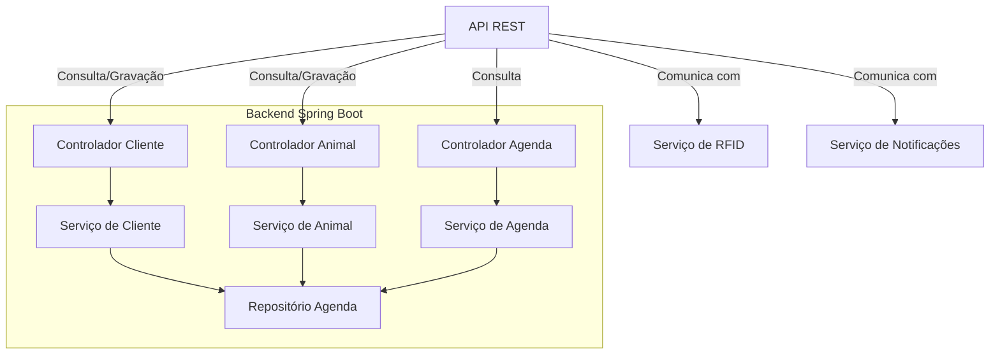
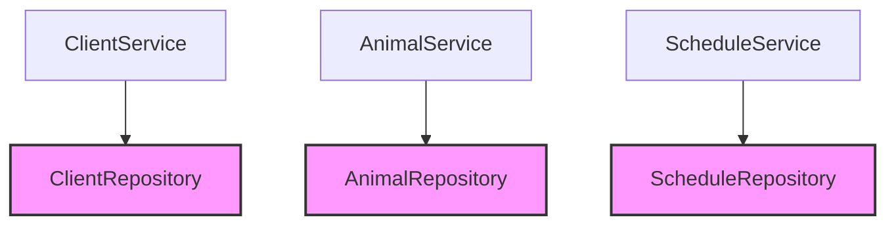
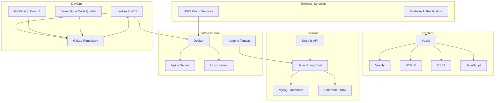

# SandyHonda

- [SandyHonda](#sandyhonda)
- [1. Introdução](#1-introdução)
- [2. Descrição do negócio](#2-descrição-do-negócio)
  - [2.1. Requisitos](#21-requisitos)
    - [Requisitos Funcionais e Não Funcionais](#requisitos-funcionais-e-não-funcionais)
- [3. Visão geral do sistema](#3-visão-geral-do-sistema)
- [4. Diagrama ER](#4-diagrama-er)
  - [4.1.  Descrição Entidade e Relacionamento](#41--descrição-entidade-e-relacionamento)
- [5. Diagrama de classes](#5-diagrama-de-classes)
- [6. casos de uso](#6-casos-de-uso)
  - [6.1 Casos de uso](#61-casos-de-uso)
  - [6.2 Histórias de usuario](#62-histórias-de-usuario)
    - [1. Marcar Animais com RFID](#1-marcar-animais-com-rfid)
    - [2. Atender Apenas Gatos e Cachorros](#2-atender-apenas-gatos-e-cachorros)
    - [3. Cadastro de Clientes e Animais](#3-cadastro-de-clientes-e-animais)
    - [4. Informar Condições do Animal](#4-informar-condições-do-animal)
    - [5. Informar Tipo de Ração](#5-informar-tipo-de-ração)
    - [6. Informar Hábitos do Animal](#6-informar-hábitos-do-animal)
    - [7. Atendimentos com Mais de Um Veterinário](#7-atendimentos-com-mais-de-um-veterinário)
    - [8. Agenda do Dia para Atendimentos](#8-agenda-do-dia-para-atendimentos)
    - [9. Ficha e Prontuário para Cada Animal](#9-ficha-e-prontuário-para-cada-animal)
    - [10. Marcar Horários Futuramente](#10-marcar-horários-futuramente)
    - [11. Atendimento Gera Receita](#11-atendimento-gera-receita)
    - [12. Atendimento Inicial pelo Atendente](#12-atendimento-inicial-pelo-atendente)
    - [13. Verificar Agenda de Veterinários](#13-verificar-agenda-de-veterinários)
    - [14. Colocar na Fila de Espera](#14-colocar-na-fila-de-espera)
    - [15. Levar Cliente ao Veterinário](#15-levar-cliente-ao-veterinário)
    - [16. Realizar Entrevista com o Dono](#16-realizar-entrevista-com-o-dono)
    - [17. Registro do Resultado da Entrevista](#17-registro-do-resultado-da-entrevista)
    - [18. Anotar Observações no Prontuário](#18-anotar-observações-no-prontuário)
    - [19. Receitar Medicamentos](#19-receitar-medicamentos)
    - [20. Serviços de Banho e Tosa](#20-serviços-de-banho-e-tosa)
    - [21. Realização de Cirurgias, Injeções e Curativos](#21-realização-de-cirurgias-injeções-e-curativos)
    - [22. Serviço de Pintura de Cachorro](#22-serviço-de-pintura-de-cachorro)
    - [23. Serviços de Fisioterapia e Nutrição](#23-serviços-de-fisioterapia-e-nutrição)
    - [24. Visualizar Animais e Fichas](#24-visualizar-animais-e-fichas)
    - [25. Visualizar Receitas](#25-visualizar-receitas)
    - [26. Auxílio para Animais com Sobrepeso](#26-auxílio-para-animais-com-sobrepeso)
    - [27. Acesso ao Receituário dos Animais](#27-acesso-ao-receituário-dos-animais)
    - [28. Comunicação Direta com Profissionais](#28-comunicação-direta-com-profissionais)
    - [29. Serviço de Hotel para Animais](#29-serviço-de-hotel-para-animais)
- [7. Diagrama de compenentes](#7-diagrama-de-compenentes)
- [8. Diagrama de implantação](#8-diagrama-de-implantação)
- [9. Diagramas C4](#9-diagramas-c4)
  - [9.1. Diagrama de contexto](#91-diagrama-de-contexto)
  - [9.2. Diagrama de container](#92-diagrama-de-container)
  - [9.3. Diagrama de componente](#93-diagrama-de-componente)
  - [9.4. Diagrama de código](#94-diagrama-de-código)
- [10. Protótipo de telas](#10-protótipo-de-telas)
    - [1. Tela Inicial](#1-tela-inicial)
    - [2. Agenda](#2-agenda)
    - [3. Editar Agenda](#3-editar-agenda)
    - [4. Detalhes Agenda](#4-detalhes-agenda)
    - [5. Animal](#5-animal)
    - [6. Editar Animal](#6-editar-animal)
    - [7. Detalhes Animal](#7-detalhes-animal)
    - [8. Atentendente](#8-atentendente)
    - [9. Editar Atendente](#9-editar-atendente)
    - [10. Detalhes Atendente](#10-detalhes-atendente)
    - [11. Cliente](#11-cliente)
    - [12. Editar Cliente](#12-editar-cliente)
    - [13. Detalhes Cliente](#13-detalhes-cliente)
    - [14. Comunicação](#14-comunicação)
    - [15. Editar Comunicação](#15-editar-comunicação)
    - [16. Detalhes Comunicação](#16-detalhes-comunicação)
    - [17. Ficha](#17-ficha)
    - [18. Editar Ficha](#18-editar-ficha)
    - [19. Detalhes Ficha](#19-detalhes-ficha)
    - [20. Hotel](#20-hotel)
    - [21. Editar Hotel](#21-editar-hotel)
    - [22. Detalhe Hotel](#22-detalhe-hotel)
    - [23. Prontuario](#23-prontuario)
    - [24. Editar Pronturario](#24-editar-pronturario)
    - [25. Detalhe Prontuario](#25-detalhe-prontuario)
    - [26. Serviço](#26-serviço)
    - [27. Editar Serviço](#27-editar-serviço)
    - [28. Detalhe Serviço](#28-detalhe-serviço)
    - [29. Veterinario](#29-veterinario)
    - [30. Editar Veterinario](#30-editar-veterinario)
    - [31. Detalhes Veterinario](#31-detalhes-veterinario)
    - [32. Atendimento](#32-atendimento)
    - [33. Editar Atendimento](#33-editar-atendimento)
    - [34. Detalhes Atendimento](#34-detalhes-atendimento)
    - [35. Grafico Barra](#35-grafico-barra)
    - [36. Grafico Pizza](#36-grafico-pizza)
    - [37. Grafico Linha](#37-grafico-linha)
    - [38. Dashboard](#38-dashboard)
- [11. Diagrama de navegação de telas](#11-diagrama-de-navegação-de-telas)
- [12. Pilha tecnologica](#12-pilha-tecnologica)
- [13. Requisitos de sistemas](#13-requisitos-de-sistemas)
  - [13.1. Requisitos lado do Cliente](#131-requisitos-lado-do-cliente)
  - [13.2. Requisitos lado do Servidor](#132-requisitos-lado-do-servidor)
- [14. Considerações sobre segurança](#14-considerações-sobre-segurança)
  - [141. Lado do Cliente](#141-lado-do-cliente)
  - [14.2. Lado Servidor](#142-lado-servidor)
- [15. Manutenção, instalação e novas funcionalidades](#15-manutenção-instalação-e-novas-funcionalidades)
  - [15.1. Instalado no servidor](#151-instalado-no-servidor)
  - [15.2. Manutenção](#152-manutenção)
  - [15.3. Novas funionalidades](#153-novas-funionalidades)
- [16. Treinamento](#16-treinamento)
  - [16.1. Usuário](#161-usuário)
  - [16.2. Admin](#162-admin)
- [17. Script SQL](#17-script-sql)
  - [17.1 Comando create table:](#171-comando-create-table)
  - [17.2 Comandos para inserção de dados ficticios:](#172-comandos-para-inserção-de-dados-ficticios)


# 1. Introdução

O projeto a seguir apresenta um sistema desenvolvido para um petshop. A empresa é condsiderada micro e iniciou suas atividades recentemente. Ao possuir serviços exclusivos, os sistemas presentes no mercado não se enquadra, desta forma, os proprietários decidiram desenvolver uma solução. Esta solução é detalhada a seguir:

[Voltar ao Início](#SandyHonda)

# 2. Descrição do negócio

Descrição do cenário onde o sistema deverá funcionar:

1. Marcar animais com RFID.
2. Uma clínica veterinária atende apenas os animais: gatos e cachorros.
3. Os clientes devem fazer um cadastro de si e dos animais.
4. Os clientes devem informar as condições nas quais os animais chegam.
5. Os clientes devem informar o tipo de ração que o animal come.
6. O cliente deve informar hábitos do animal.
7. Para cada animal é possível que mais de um veterinário o atenda.
8. Os animais podem chegar e serem atendidos de acordo com uma agenda do dia.
9. Cada animal atendido receberá uma ficha e um prontuário.
10. Outros dono podem querer marcar horários de atendimento futuro.
11. O atendimento gera uma receita para o animal.
12. Quando um cliente chega na clínica veterinária ele é atendido por um atendente.
13. O atendente deve verificar se existe agenda disponível com um veterinário.
14. O atendente deve colocar o cliente e seu animal na fila de espera, se for o caso.
15. O atendente deve levar o cliente e o animal até o veterinário.
16. O veterinário deve realizar uma entrevista com o dono do animal.
17. O resultado da entrevista deve ir para um formulário.
18. O veterinário deverá examinar o animal e anotar em prontuário(ficha) suas observações.
19. Dependendo da situação do animal este receberá uma receita.
20. O pet shop oferece serviços de banho e tosa.
21. A pet shop realiza cirurgias, injeções e curativos.
22. O cliente pode escolher se quer o serviço de pintura de cachorro.
23. São oferecidos serviços de fisioterapia e nutrição
24. O sistema deve permitir que o cliente possa visualizar seus animais e suas fichas.
25. O sistema deve permitir que o cliente possa visualizar suas receitas.
26. A pet shop tem serviços para auxiliar os donos de animais com sobrepeso.
27. A pet shop deve oferecer aos clientes um lugar para ter acesso ao receituario dos animais.
28. A pet shop deve oferecer um meio de comunicação direta com os profissionais para que os donos possão sanar eventuais dúvidas.
29. A petshop oferece serviços de hotel para animais.

[Voltar ao Início](#SandyHonda)

## 2.1. Requisitos

### Requisitos Funcionais e Não Funcionais

| **Tipo de Requisito** | **Descrição**                                                                                           |
|------------------------|-------------------------------------------------------------------------------------------------------|
| **Funcional**          | Marcar animais com RFID.                                                                              |
|           | Realizar cadastro dos clientes e seus animais.                                                       |
|           | Permitir que clientes informem as condições dos animais ao chegar.                                    |
|           | Registrar o tipo de ração consumida pelo animal.                                                     |
|           | Registrar os hábitos do animal.                                                                      |
|           | Permitir que mais de um veterinário atenda o mesmo animal.                                            |
|           | Gerenciar uma agenda de atendimento diário para os animais.                                          |
|           | Criar ficha e prontuário para cada animal atendido.                                                  |
|           | Permitir o agendamento de horários de atendimento futuros.                                           |
|           | Gerar uma receita após o atendimento.                                                                |
|           | Permitir o atendimento de clientes por um atendente na chegada.                                      |
|           | Verificar disponibilidade de agenda com veterinários.                                                |
|           | Gerenciar uma fila de espera, se necessário.                                                         |
|           | Realizar entrevistas com donos dos animais e armazenar os resultados.                                |
|           | Registrar observações do veterinário no prontuário do animal.                                        |
|           | Oferecer serviços de banho, tosa, cirurgias, injeções e curativos.                                   |
|           | Disponibilizar serviços de fisioterapia, nutrição e pintura de cachorros.                            |
|           | Permitir que clientes visualizem fichas e receitas dos seus animais.                                 |
|           | Auxiliar donos de animais com sobrepeso.                                                             |
|           | Oferecer um meio de comunicação direta entre clientes e profissionais.                               |
|           | Disponibilizar serviços de hotel para animais.                                                       |
| **Não Funcional**      | O sistema deve ser acessível por dispositivos móveis e desktops.                                      |
|       | Garantir a segurança dos dados armazenados no sistema.                                               |
|       | Oferecer tempos de resposta inferiores a 2 segundos para operações comuns.                           |
|       | Garantir alta disponibilidade do sistema, com uptime superior a 99%.                                 |
|       | Permitir integração com dispositivos RFID para identificação dos animais.                            |
|       | Armazenar os dados em um banco de dados relacional (ex.: MySQL).                                      |
|       | Garantir conformidade com a Lei Geral de Proteção de Dados (LGPD).                                   |
|       | Implementar sistema de notificações em tempo real para atualizações sobre o status dos animais.       |
|       | Suportar mais de 100 conexões simultâneas sem perda significativa de desempenho.                      |
|       | Utilizar autenticação baseada em tokens para garantir segurança no login dos usuários.               |

[Voltar ao Início](#SandyHonda)

# 3. Visão geral do sistema

Descrição do sistema e suas relações.

Descreva o que o sistema entrega do ponto de vista do usuario final.

# 4. Diagrama ER

## 4.1.  Descrição Entidade e Relacionamento



[Voltar ao Início](#SandyHonda)

# 5. Diagrama de classes


[Voltar ao Início](#SandyHonda)

# 6. casos de uso 

## 6.1 Casos de uso


## 6.2 Histórias de usuario

### 1. Marcar Animais com RFID

**Como um** veterinário  
**Eu quero** marcar os animais com um código RFID  
**Para que** eu possa identificá-los rapidamente no sistema e garantir o controle sobre seu histórico.

### 2. Atender Apenas Gatos e Cachorros

**Como uma** clínica veterinária  
**Eu quero** limitar o atendimento a gatos e cachorros  
**Para que** possamos focar nosso atendimento especializado nessas espécies.

### 3. Cadastro de Clientes e Animais
**Como um** cliente  
**Eu quero** fazer um cadastro no sistema para mim e para meus animais  
**Para que** eu possa ter meus dados e os dados dos meus animais registrados no sistema.

### 4. Informar Condições do Animal
**Como um** cliente  
**Eu quero** informar as condições nas quais meu animal chegou à clínica  
**Para que** os veterinários possam ter essa informação no atendimento.

### 5. Informar Tipo de Ração
**Como um** cliente  
**Eu quero** informar o tipo de ração que meu animal consome  
**Para que** o veterinário possa ajustar o tratamento ou fazer recomendações adequadas.

### 6. Informar Hábitos do Animal
**Como um** cliente  
**Eu quero** informar os hábitos do meu animal  
**Para que** o veterinário tenha mais informações para realizar o diagnóstico.

### 7. Atendimentos com Mais de Um Veterinário
**Como um** sistema  
**Eu quero** permitir que mais de um veterinário atenda o mesmo animal  
**Para que** seja possível realizar atendimentos colaborativos e mais completos.

### 8. Agenda do Dia para Atendimentos
**Como um** cliente  
**Eu quero** que meu animal seja atendido de acordo com uma agenda do dia  
**Para que** eu possa planejar melhor meu tempo e o atendimento do meu animal.

### 9. Ficha e Prontuário para Cada Animal
**Como um** veterinário  
**Eu quero** criar uma ficha e um prontuário para cada animal atendido  
**Para que** eu possa registrar o histórico médico e o tratamento do animal.

### 10. Marcar Horários Futuramente
**Como um** cliente  
**Eu quero** poder agendar atendimentos futuros para meu animal  
**Para que** eu possa garantir um horário conveniente para o tratamento.

### 11. Atendimento Gera Receita
**Como um** veterinário  
**Eu quero** gerar uma receita médica ao finalizar o atendimento  
**Para que** o cliente saiba qual medicação ou tratamento seu animal precisa seguir.

### 12. Atendimento Inicial pelo Atendente
**Como um** cliente  
**Eu quero** ser atendido inicialmente por um atendente ao chegar à clínica  
**Para que** meu caso seja direcionado adequadamente.

### 13. Verificar Agenda de Veterinários
**Como um** atendente  
**Eu quero** verificar se há veterinários disponíveis na agenda  
**Para que** eu possa confirmar se o atendimento pode ser realizado.

### 14. Colocar na Fila de Espera
**Como um** atendente  
**Eu quero** colocar o cliente e seu animal na fila de espera  
**Para que** eles aguardem caso não haja veterinário disponível no momento.

### 15. Levar Cliente ao Veterinário
**Como um** atendente  
**Eu quero** encaminhar o cliente e seu animal ao veterinário  
**Para que** o atendimento possa ser realizado após o cadastro.

### 16. Realizar Entrevista com o Dono
**Como um** veterinário  
**Eu quero** realizar uma entrevista com o dono do animal  
**Para que** eu possa coletar todas as informações necessárias para o atendimento.

### 17. Registro do Resultado da Entrevista
**Como um** veterinário  
**Eu quero** registrar o resultado da entrevista com o dono em um formulário  
**Para que** essas informações estejam disponíveis no prontuário.

### 18. Anotar Observações no Prontuário
**Como um** veterinário  
**Eu quero** anotar minhas observações no prontuário do animal  
**Para que** o histórico de saúde do animal esteja sempre atualizado.

### 19. Receitar Medicamentos
**Como um** veterinário  
**Eu quero** prescrever uma receita médica para o animal  
**Para que** o dono saiba qual tratamento seguir.

### 20. Serviços de Banho e Tosa
**Como um** cliente  
**Eu quero** utilizar os serviços de banho e tosa oferecidos pela clínica  
**Para que** meu animal esteja sempre bem cuidado.

### 21. Realização de Cirurgias, Injeções e Curativos
**Como um** veterinário  
**Eu quero** realizar cirurgias, injeções e curativos  
**Para que** o animal receba o tratamento necessário.

### 22. Serviço de Pintura de Cachorro
**Como um** cliente  
**Eu quero** escolher o serviço de pintura de cachorro  
**Para que** meu animal possa receber um tratamento estético diferenciado.

### 23. Serviços de Fisioterapia e Nutrição
**Como um** cliente  
**Eu quero** utilizar os serviços de fisioterapia e nutrição oferecidos pela clínica  
**Para que** meu animal tenha uma melhor qualidade de vida.

### 24. Visualizar Animais e Fichas
**Como um** cliente  
**Eu quero** visualizar meus animais e suas fichas de atendimento  
**Para que** eu possa acompanhar o histórico médico de cada um deles.

### 25. Visualizar Receitas
**Como um** cliente  
**Eu quero** visualizar as receitas médicas dos meus animais  
**Para que** eu saiba quais medicamentos seguir.

### 26. Auxílio para Animais com Sobrepeso
**Como um** cliente  
**Eu quero** utilizar os serviços oferecidos para animais com sobrepeso  
**Para que** meu animal receba o suporte necessário para sua saúde.

### 27. Acesso ao Receituário dos Animais
**Como um** cliente  
**Eu quero** ter acesso ao receituário dos meus animais  
**Para que** eu possa consultar todas as receitas emitidas.

### 28. Comunicação Direta com Profissionais
**Como um** cliente  
**Eu quero** ter um meio de comunicação direta com os profissionais da clínica  
**Para que** eu possa sanar dúvidas sobre meu animal a qualquer momento.

### 29. Serviço de Hotel para Animais
**Como um** cliente  
**Eu quero** utilizar o serviço de hotel para animais oferecido pela pet shop  
**Para que** meu animal tenha um lugar seguro para ficar enquanto eu estiver fora.

[Voltar ao Início](#SandyHonda)

# 7. Diagrama de compenentes


[Voltar ao Início](#SandyHonda)

# 8. Diagrama de implantação


[Voltar ao Início](#SandyHonda)

# 9. Diagramas C4
 
## 9.1. Diagrama de contexto



## 9.2. Diagrama de container



## 9.3. Diagrama de componente



## 9.4. Diagrama de código



[Voltar ao Início](# SandyHonda)

# 10. Protótipo de telas

### 1. Tela Inicial


### 2. Agenda

![!\[alt text\]](imagens/agenda.jpeg)

### 3. Editar Agenda

![!\[alt text\]](imagens/editar_agenda.jpeg)

### 4. Detalhes Agenda

![!\[alt text\]](imagens/detalhes_agenda.jpeg)

### 5. Animal

![!\[alt text\]](imagens/animal.jpeg)

### 6. Editar Animal

![!\[alt text\]](imagens/editar_animal.jpeg)

### 7. Detalhes Animal

![!\[alt text\]](imagens/detalhes_animal.jpeg)

### 8. Atentendente

![!\[alt text\]](imagens/atentendente.jpeg)

### 9. Editar Atendente

![!\[alt text\]](imagens/editar_atendente.jpeg)

### 10. Detalhes Atendente

![!\[alt text\]](imagens/detalhes_atendente.jpeg)

### 11. Cliente

![!\[alt text\]](imagens/cliente.jpeg)

### 12. Editar Cliente

![!\[alt text\]](imagens/cliente_editar.jpeg)

### 13. Detalhes Cliente

![!\[alt text\]](imagens/detalhes_cliente.jpeg)

### 14. Comunicação

![!\[alt text\]](imagens/comunicação.jpeg)

### 15. Editar Comunicação

![!\[alt text\]](imagens/editar_comunicação.jpeg)

### 16. Detalhes Comunicação

![!\[alt text\]](imagens/detalhes_comunicação.jpeg)

### 17. Ficha

![!\[alt text\]](imagens/ficha.jpeg)

### 18. Editar Ficha

![!\[alt text\]](imagens/editar_ficha.jpeg)

### 19. Detalhes Ficha

![!\[alt text\]](imagens/detalhes_ficha.jpeg)

### 20. Hotel

![!\[alt text\]](imagens/hotel.jpeg)

### 21. Editar Hotel

![!\[alt text\]](imagens/editar_hotel.jpeg)

### 22. Detalhe Hotel

![!\[alt text\]](imagens/detalhe_hotel.jpeg)

### 23. Prontuario

![!\[alt text\]](imagens/prontuario.jpeg)

### 24. Editar Pronturario

![!\[alt text\]](imagens/editar_pronturario.jpeg)

### 25. Detalhe Prontuario

![!\[alt text\]](imagens/detalhe_prontuario.jpeg)

### 26. Serviço

![!\[alt text\]](imagens/serviço.jpeg)

### 27. Editar Serviço

![!\[alt text\]](imagens/editar_serviço.jpeg)

### 28. Detalhe Serviço

![!\[alt text\]](imagens/detalhe_serviço.jpeg)

### 29. Veterinario

![!\[alt text\]](imagens/veterinario.jpeg)

### 30. Editar Veterinario

![!\[alt text\]](imagens/editar_veterinario.jpeg)

### 31. Detalhes Veterinario

![!\[alt text\]](imagens/detalhes_veterinario.jpeg)

### 32. Atendimento

![!\[alt text\]](imagens/atendimento.jpeg)

### 33. Editar Atendimento

![!\[alt text\]](imagens/editar_atendimento.jpeg)

### 34. Detalhes Atendimento


![!\[alt text\]](imagens/detalhes_atendimento.jpeg)


### 35. Grafico Barra

![!\[alt text\]](imagens/grafico_barra.jpeg)

### 36. Grafico Pizza

![!\[alt text\]](imagens/grafico_pizza.jpeg)

### 37. Grafico Linha

![!\[alt text\]](imagens/grafico_linha.jpeg)

### 38. Dashboard


[Voltar ao Início](#SandyHonda)

    
# 11. Diagrama de navegação de telas

```mermaid
graph TD;
    Login --> Menu
    Menu --> Cadastro_Cliente[Cadastro de Cliente]
    Menu --> Cadastro_Animal[Cadastro de Animal]
    Menu --> Agenda[Agenda de Atendimentos]
    Menu --> Fichas[Consulta Fichas]
    Menu --> 
    Receitas[Consulta Receitas]
    Menu --> Servicos_PetShop[Serviços Pet Shop]
    Menu --> Comunicacao[Comunicação com Profissionais]
    Menu --> Hotel[Serviços de Hotel para Animais]
    
    Cadastro_Cliente --> Cadastro_Animal
    Cadastro_Animal --> Condicoes_Animal[Informar Condições do Animal]
    Cadastro_Animal --> Racao[Informar Tipo de Ração]
    Cadastro_Animal --> Habitos[Informar Hábitos do Animal]
    
    Agenda --> Fila_Espera[Colocar em Fila de Espera]
    Agenda --> Marcar_Atendimento[Marcar Atendimento Futuro]
    Agenda --> Verificar_Disponibilidade[Verificar Disponibilidade de Veterinário]
    
    Fichas --> Prontuarios[Consulta de Prontuários]
    Fichas --> Exames[Anotações de Exames]

    Receitas --> Visualizar_Receitas[Visualizar Receituário]

    Servicos_PetShop --> Banho_Tosa[Banho e Tosa]
    Servicos_PetShop --> Cirurgias[Cirurgias, Injeções e Curativos]
    Servicos_PetShop --> Fisioterapia_Nutricao[Fisioterapia e Nutrição]
    Servicos_PetShop --> Pintura[Pintura de Cachorro]
    Servicos_PetShop --> Sobrepeso[Auxílio para Animais com Sobrepeso]
    
    Comunicacao --> Dúvidas_Profissionais[Sanar Dúvidas com Profissionais]

    Hotel --> Marcar_Hospedagem[Marcar Hospedagem]
```


[Voltar ao Início](#SandyHonda)

# 12. Pilha tecnologica 



[Voltar ao Início](#SandyHonda)

# 13. Requisitos de sistemas 

## 13.1. Requisitos lado do Cliente


## 13.2. Requisitos lado do Servidor

[Voltar ao Início](#SandyHonda)

# 14. Considerações sobre segurança

## 141. Lado do Cliente

1. Regras de senha;
2. catcha, qtda min. caracteres, caracteres especieais, etc...
3. autenticação de 2 fatores;
4. recuperação de senha com e-mail.
5. código no e-mail.
6. anti virus.
7. 
>> mini politica de segurança

## 14.2. Lado Servidor

* Linux
* Politica de backup e aplicação de banco

1. 1x por mês 1 full backup;
2. 1x a cada 15 dias 1 full backup;
3. no final de cada dia um backup incremental;
4. o admin do sistema não acessa dados do usuario;
5. 

[Voltar ao Início](#SandyHonda)

# 15. Manutenção, instalação e novas funcionalidades

## 15.1. Instalado no servidor 

manutenção 

## 15.2. Manutenção

manter o mesmo mas manter funcionando extamente como é

## 15.3. Novas funionalidades

1. Formalização do pedido;
2. Cliente não dá palpite em beleza de tela;
3. Decidir sob 3 critérios: <br>
   a) A equipe tem tempo? <br>
   b) É economicamente viável? <br>
   c) É tecnologicamente viável?

[Voltar ao Início](#SandyHonda)

# 16. Treinamento

## 16.1. Usuário

## 16.2. Admin


[Voltar ao Início](#SandyHonda)

# 17. Script SQL

## 17.1 Comando create table:

```SQL
-- Tabela para Clientes
CREATE TABLE Cliente (
    id_cliente INT PRIMARY KEY AUTO_INCREMENT,
    nome VARCHAR(100) NOT NULL,
    telefone VARCHAR(20),
    endereco VARCHAR(200)
);

-- Tabela para Animais
CREATE TABLE Animal (
    id_animal INT PRIMARY KEY AUTO_INCREMENT,
    nome VARCHAR(100) NOT NULL,
    rfid VARCHAR(50) UNIQUE NOT NULL,
    especie ENUM('gato', 'cachorro') NOT NULL,
    condicoes_chegada TEXT,
    tipo_racao VARCHAR(100),
    habitos TEXT,
    id_cliente INT,
    FOREIGN KEY (id_cliente) REFERENCES Cliente(id_cliente)
);

-- Tabela para Veterinários
CREATE TABLE Veterinario (
    id_veterinario INT PRIMARY KEY AUTO_INCREMENT,
    nome VARCHAR(100) NOT NULL,
    especialidade VARCHAR(100)
);

-- Tabela para Ficha de Atendimento
CREATE TABLE Ficha (
    id_ficha INT PRIMARY KEY AUTO_INCREMENT,
    observacoes TEXT,
    id_animal INT,
    FOREIGN KEY (id_animal) REFERENCES Animal(id_animal)
);

-- Tabela para Prontuário
CREATE TABLE Prontuario (
    id_prontuario INT PRIMARY KEY AUTO_INCREMENT,
    detalhes TEXT,
    receita TEXT,
    id_ficha INT,
    FOREIGN KEY (id_ficha) REFERENCES Ficha(id_ficha)
);

-- Tabela para Atendentes
CREATE TABLE Atendente (
    id_atendente INT PRIMARY KEY AUTO_INCREMENT,
    nome VARCHAR(100) NOT NULL
);

-- Tabela para Agendamento
CREATE TABLE Agenda (
    id_agenda INT PRIMARY KEY AUTO_INCREMENT,
    data DATE NOT NULL,
    horario TIME NOT NULL,
    status VARCHAR(50),
    id_animal INT,
    id_veterinario INT,
    id_cliente INT,
    FOREIGN KEY (id_animal) REFERENCES Animal(id_animal),
    FOREIGN KEY (id_veterinario) REFERENCES Veterinario(id_veterinario),
    FOREIGN KEY (id_cliente) REFERENCES Cliente(id_cliente)
);

-- Tabela para Serviços da Pet Shop
CREATE TABLE Servico (
    id_servico INT PRIMARY KEY AUTO_INCREMENT,
    tipo VARCHAR(100) NOT NULL,  -- banho, tosa, cirurgia, fisioterapia, etc.
    descricao TEXT,
    preco DECIMAL(10, 2)
);

-- Tabela para Comunicação entre Cliente e Profissional
CREATE TABLE Comunicacao (
    id_comunicacao INT PRIMARY KEY AUTO_INCREMENT,
    mensagem TEXT NOT NULL,
    data_envio DATETIME NOT NULL,
    data_resposta DATETIME,
    id_cliente INT,
    id_veterinario INT,
    FOREIGN KEY (id_cliente) REFERENCES Cliente(id_cliente),
    FOREIGN KEY (id_veterinario) REFERENCES Veterinario(id_veterinario)
);

-- Tabela para Hotel de Animais
CREATE TABLE Hotel (
    id_hotel INT PRIMARY KEY AUTO_INCREMENT,
    checkin DATE,
    checkout DATE,
    detalhes TEXT,
    id_animal INT,
    FOREIGN KEY (id_animal) REFERENCES Animal(id_animal)
);

-- Tabela para Relacionar Veterinários que Atendem Animais
CREATE TABLE Veterinario_Atendimento (
    id_animal INT,
    id_veterinario INT,
    PRIMARY KEY (id_animal, id_veterinario),
    FOREIGN KEY (id_animal) REFERENCES Animal(id_animal),
    FOREIGN KEY (id_veterinario) REFERENCES Veterinario(id_veterinario)
);
```

[Voltar ao Início](#SandyHonda)

## 17.2 Comandos para inserção de dados ficticios:

```SQL
-- Inserindo Clientes
INSERT INTO Cliente (nome, telefone, endereco) VALUES 
('João Silva', '555-1234', 'Rua A, 123'),
('Maria Souza', '555-5678', 'Avenida B, 456'),
('Carlos Pereira', '555-8765', 'Travessa C, 789');

-- Inserindo Animais
INSERT INTO Animal (nome, rfid, especie, condicoes_chegada, tipo_racao, habitos, id_cliente) VALUES 
('Rex', 'RFID123', 'cachorro', 'Chegou com ferimentos na pata', 'Ração Premium', 'Brincalhão, gosta de correr', 1),
('Mimi', 'RFID456', 'gato', 'Chegou com tosse e espirros', 'Ração Light', 'Calmo, gosta de dormir', 2),
('Bolt', 'RFID789', 'cachorro', 'Chegou cansado e sem apetite', 'Ração Energy', 'Muito ativo, corre bastante', 3);

-- Inserindo Veterinários
INSERT INTO Veterinario (nome, especialidade) VALUES 
('Dra. Ana Mendes', 'Cirurgia Geral'),
('Dr. Pedro Oliveira', 'Nutrição e Fisioterapia'),
('Dra. Laura Ribeiro', 'Clínica Geral');

-- Inserindo Fichas
INSERT INTO Ficha (observacoes, id_animal) VALUES 
('Animal apresenta cortes superficiais na pata.', 1),
('Animal com sinais de infecção respiratória leve.', 2),
('Exame físico mostra sinais de exaustão.', 3);

-- Inserindo Prontuários
INSERT INTO Prontuario (detalhes, receita, id_ficha) VALUES 
('Receitado pomada para aplicar na pata 2x ao dia.', 'Pomada Cicatrizante', 1),
('Receitado antibiótico por 7 dias.', 'Antibiótico XYZ', 2),
('Receitado descanso e suplementação de vitaminas.', 'Suplemento Vitaminico', 3);

-- Inserindo Atendentes
INSERT INTO Atendente (nome) VALUES 
('Lucas Santos'),
('Fernanda Lima'),
('Ricardo Carvalho');

-- Inserindo Agendamentos
INSERT INTO Agenda (data, horario, status, id_animal, id_veterinario, id_cliente) VALUES 
('2024-09-17', '09:30:00', 'Confirmado', 1, 1, 1),
('2024-09-18', '11:00:00', 'Pendente', 2, 2, 2),
('2024-09-18', '14:00:00', 'Confirmado', 3, 3, 3);

-- Inserindo Serviços da Pet Shop
INSERT INTO Servico (tipo, descricao, preco) VALUES 
('Banho', 'Banho completo com shampoo especial', 50.00),
('Tosa', 'Tosa completa ou parcial', 70.00),
('Fisioterapia', 'Sessão de fisioterapia para reabilitação', 150.00),
('Cirurgia', 'Cirurgia geral para tratamento de problemas diversos', 500.00);

-- Inserindo Comunicação entre Cliente e Veterinário
INSERT INTO Comunicacao (mensagem, data_envio, data_resposta, id_cliente, id_veterinario) VALUES 
('Meu cachorro ainda está mancando, o que faço?', '2024-09-16 10:00:00', '2024-09-16 12:00:00', 1, 1),
('A tosse do gato piorou, devo trazer de novo?', '2024-09-17 15:00:00', NULL, 2, 2),
('O cachorro está se recuperando, precisa voltar para fisioterapia?', '2024-09-18 09:00:00', NULL, 3, 3);

-- Inserindo Registro de Hotel
INSERT INTO Hotel (checkin, checkout, detalhes, id_animal) VALUES 
('2024-09-20', '2024-09-25', 'Animal ficou hospedado e recebeu cuidados especiais', 1),
('2024-09-22', '2024-09-28', 'Animal hospedado e com dieta personalizada', 2),
('2024-09-25', '2024-09-30', 'Animal hospedado com tratamento fisioterápico', 3);

-- Inserindo Relação entre Veterinário e Animais Atendidos
INSERT INTO Veterinario_Atendimento (id_animal, id_veterinario) VALUES 
(1, 1),
(2, 2),
(3, 3),
(1, 3); -- O animal 1 também foi atendido por outro veterinário
```
[Voltar ao Início](#SandyHonda)
