# SandyHonda

- [SandyHonda](#sandyhonda)
- [1. Introdução](#1-introdução)
- [2. Descrição do negócio](#2-descrição-do-negócio)
- [3. Visão geral do sistema](#3-visão-geral-do-sistema)
- [4. Diagrama ER](#4-diagrama-er)
- [5. Diagrama de classes](#5-diagrama-de-classes)
- [6. casos de uso](#6-casos-de-uso)
- [7. Diagrama de compenentes](#7-diagrama-de-compenentes)
- [8. Diagrama de implantação](#8-diagrama-de-implantação)
- [9. Protótipo de telas](#9-protótipo-de-telas)
- [10. Diagrama de navegação de telas](#10-diagrama-de-navegação-de-telas)
- [11. Pilha tecnologica](#11-pilha-tecnologica)
- [12. Requisitos de sistemas](#12-requisitos-de-sistemas)
- [13. Considerações sobre segurança](#13-considerações-sobre-segurança)
- [14. Manutenção e instalação](#14-manutenção-e-instalação)
- [15. Glossário](#15-glossário)
- [16. Script SQL](#16-script-sql)

# 1. Introdução

O projeto a seguir apresenta um sistema desenvolvido para um petshop. A empresa é condsiderada micro e iniciou suas atividades recentemente. Ao possuir serviços exclusivos, os sistemas presentes no mercado não se enquadra, desta forma, os proprietários decidiram desenvolver uma solução. Esta solução é detalhada a seguir:

# 2. Descrição do negócio

Descrição do cenário onde o sistema deverá funcionar:

1. Marcar animais com RFID.
2. Uma clínica veterinária atende apenas os animais: gatos e cachorros.
3. Os clientes devem fazer um cadastro de si e dos animais.
4. Os clientes devem informar as condições nas quais os animais chegam.
5. Os clientes devem informar o tipo de ração que o animal come.
6. O cliente deve informar hábitos do animal.
7. Para cada animal é possível que mais de um veterinário o atenda.
8. Os animais podem chegar e serem atendidos de acordo com uma agenda do dia.
9. Cada animal atendido receberá uma ficha e um prontuário.
10. Outros dono podem querer marcar horários de atendimento futuro.
11. O atendimento gera uma receita para o animal.
12. Quando um cliente chega na clínica veterinária ele é atendido por um atendente.
13. O atendente deve verificar se existe agenda disponível com um veterinário.
14. O atendente deve colocar o cliente e seu animal na fila de espera, se for o caso.
15. O atendente deve levar o cliente e o animal até o veterinário.
16. O veterinário deve realizar uma entrevista com o dono do animal.
17. O resultado da entrevista deve ir para um formulário.
18. O veterinário deverá examinar o animal e anotar em prontuário(ficha) suas observações.
19. Dependendo da situação do animal este receberá uma receita.
20. O pet shop oferece serviços de banho e tosa.
21. A pet shop realiza cirurgias, injeções e curativos.
22. O cliente pode escolher se quer o serviço de pintura de cachorro.
23. São oferecidos serviços de fisioterapia e nutrição
24. O sistema deve permitir que o cliente possa visualizar seus animais e suas fichas.
25. O sistema deve permitir que o cliente possa visualizar suas receitas.
26. A pet shop tem serviços para auxiliar os donos de animais com sobrepeso.
27. A pet shop deve oferecer aos clientes um lugar para ter acesso ao receituario dos animais.
28. A pet shop deve oferecer um meio de comunicação direta com os profissionais para que os donos possão sanar eventuais dúvidas.
29. A petshop oferece serviços de hotel para animais.

# 3. Visão geral do sistema

Descrição do sistema e suas relações.

# 4. Diagrama ER
* 4.1.  Descrição Entidade e Relacionamento

```mermaid
erDiagram
    CLIENTE {
        int id_cliente PK
        string nome
        string telefone
        string endereco
    }
    ANIMAL {
        int id_animal PK
        string nome
        string rfid
        string especie
        string condicoes_chegada
        string tipo_racao
        string habitos
    }

    VETERINARIO {
        int id_veterinario PK
        string nome
        string especialidade
    }

    ATENDENTE {
        int id_atendente PK
        string nome
    }

    AGENDA {
        int id_agenda PK
        date data
        time horario
        string status
    }

    FICHA {
        int id_ficha PK
        string observacoes
    }

    PRONTUARIO {
        int id_prontuario PK
        string detalhes
        string receita
    }

    SERVICO {
        int id_servico PK
        string tipo
        string descricao
        float preco
    }

    COMUNICACAO {
        int id_comunicacao PK
        string mensagem
        date data_envio
        date data_resposta
    }

    HOTEL {
        int id_hotel PK
        date checkin
        date checkout
        string detalhes
    }

    CLIENTE ||--o{ ANIMAL : "possui"
    ANIMAL ||--o{ VETERINARIO : "é atendido por"
    ANIMAL ||--o{ FICHA : "tem"
    FICHA ||--|| PRONTUARIO : "tem"
    VETERINARIO ||--o{ AGENDA : "disponível em"
    CLIENTE ||--o{ AGENDA : "marca"
    ANIMAL ||--o{ SERVICO : "recebe"
    CLIENTE ||--o{ COMUNICACAO : "tem"
    CLIENTE ||--o{ HOTEL : "marca"
    ANIMAL ||--o{ HOTEL : "fica hospedado em"
    ATENDENTE ||--o{ AGENDA : "verifica"
```





# 5. Diagrama de classes


# 6. casos de uso 

# 7. Diagrama de compenentes

# 8. Diagrama de implantação

# 9. Protótipo de telas

# 10. Diagrama de navegação de telas

# 11. Pilha tecnologica 

# 12. Requisitos de sistemas 

# 13. Considerações sobre segurança

# 14. Manutenção e instalação

# 15. Glossário

# 16. Script SQL

* 16.1 Comando create table:
```SQL
-- Tabela para Clientes
CREATE TABLE Cliente (
    id_cliente INT PRIMARY KEY AUTO_INCREMENT,
    nome VARCHAR(100) NOT NULL,
    telefone VARCHAR(20),
    endereco VARCHAR(200)
);

-- Tabela para Animais
CREATE TABLE Animal (
    id_animal INT PRIMARY KEY AUTO_INCREMENT,
    nome VARCHAR(100) NOT NULL,
    rfid VARCHAR(50) UNIQUE NOT NULL,
    especie ENUM('gato', 'cachorro') NOT NULL,
    condicoes_chegada TEXT,
    tipo_racao VARCHAR(100),
    habitos TEXT,
    id_cliente INT,
    FOREIGN KEY (id_cliente) REFERENCES Cliente(id_cliente)
);

-- Tabela para Veterinários
CREATE TABLE Veterinario (
    id_veterinario INT PRIMARY KEY AUTO_INCREMENT,
    nome VARCHAR(100) NOT NULL,
    especialidade VARCHAR(100)
);

-- Tabela para Ficha de Atendimento
CREATE TABLE Ficha (
    id_ficha INT PRIMARY KEY AUTO_INCREMENT,
    observacoes TEXT,
    id_animal INT,
    FOREIGN KEY (id_animal) REFERENCES Animal(id_animal)
);

-- Tabela para Prontuário
CREATE TABLE Prontuario (
    id_prontuario INT PRIMARY KEY AUTO_INCREMENT,
    detalhes TEXT,
    receita TEXT,
    id_ficha INT,
    FOREIGN KEY (id_ficha) REFERENCES Ficha(id_ficha)
);

-- Tabela para Atendentes
CREATE TABLE Atendente (
    id_atendente INT PRIMARY KEY AUTO_INCREMENT,
    nome VARCHAR(100) NOT NULL
);

-- Tabela para Agendamento
CREATE TABLE Agenda (
    id_agenda INT PRIMARY KEY AUTO_INCREMENT,
    data DATE NOT NULL,
    horario TIME NOT NULL,
    status VARCHAR(50),
    id_animal INT,
    id_veterinario INT,
    id_cliente INT,
    FOREIGN KEY (id_animal) REFERENCES Animal(id_animal),
    FOREIGN KEY (id_veterinario) REFERENCES Veterinario(id_veterinario),
    FOREIGN KEY (id_cliente) REFERENCES Cliente(id_cliente)
);

-- Tabela para Serviços da Pet Shop
CREATE TABLE Servico (
    id_servico INT PRIMARY KEY AUTO_INCREMENT,
    tipo VARCHAR(100) NOT NULL,  -- banho, tosa, cirurgia, fisioterapia, etc.
    descricao TEXT,
    preco DECIMAL(10, 2)
);

-- Tabela para Comunicação entre Cliente e Profissional
CREATE TABLE Comunicacao (
    id_comunicacao INT PRIMARY KEY AUTO_INCREMENT,
    mensagem TEXT NOT NULL,
    data_envio DATETIME NOT NULL,
    data_resposta DATETIME,
    id_cliente INT,
    id_veterinario INT,
    FOREIGN KEY (id_cliente) REFERENCES Cliente(id_cliente),
    FOREIGN KEY (id_veterinario) REFERENCES Veterinario(id_veterinario)
);

-- Tabela para Hotel de Animais
CREATE TABLE Hotel (
    id_hotel INT PRIMARY KEY AUTO_INCREMENT,
    checkin DATE,
    checkout DATE,
    detalhes TEXT,
    id_animal INT,
    FOREIGN KEY (id_animal) REFERENCES Animal(id_animal)
);

-- Tabela para Relacionar Veterinários que Atendem Animais
CREATE TABLE Veterinario_Atendimento (
    id_animal INT,
    id_veterinario INT,
    PRIMARY KEY (id_animal, id_veterinario),
    FOREIGN KEY (id_animal) REFERENCES Animal(id_animal),
    FOREIGN KEY (id_veterinario) REFERENCES Veterinario(id_veterinario)
);
```
* 16.2 Comandos para inserção de dados ficticios:
```SQL
-- Inserindo Clientes
INSERT INTO Cliente (nome, telefone, endereco) VALUES 
('João Silva', '555-1234', 'Rua A, 123'),
('Maria Souza', '555-5678', 'Avenida B, 456'),
('Carlos Pereira', '555-8765', 'Travessa C, 789');

-- Inserindo Animais
INSERT INTO Animal (nome, rfid, especie, condicoes_chegada, tipo_racao, habitos, id_cliente) VALUES 
('Rex', 'RFID123', 'cachorro', 'Chegou com ferimentos na pata', 'Ração Premium', 'Brincalhão, gosta de correr', 1),
('Mimi', 'RFID456', 'gato', 'Chegou com tosse e espirros', 'Ração Light', 'Calmo, gosta de dormir', 2),
('Bolt', 'RFID789', 'cachorro', 'Chegou cansado e sem apetite', 'Ração Energy', 'Muito ativo, corre bastante', 3);

-- Inserindo Veterinários
INSERT INTO Veterinario (nome, especialidade) VALUES 
('Dra. Ana Mendes', 'Cirurgia Geral'),
('Dr. Pedro Oliveira', 'Nutrição e Fisioterapia'),
('Dra. Laura Ribeiro', 'Clínica Geral');

-- Inserindo Fichas
INSERT INTO Ficha (observacoes, id_animal) VALUES 
('Animal apresenta cortes superficiais na pata.', 1),
('Animal com sinais de infecção respiratória leve.', 2),
('Exame físico mostra sinais de exaustão.', 3);

-- Inserindo Prontuários
INSERT INTO Prontuario (detalhes, receita, id_ficha) VALUES 
('Receitado pomada para aplicar na pata 2x ao dia.', 'Pomada Cicatrizante', 1),
('Receitado antibiótico por 7 dias.', 'Antibiótico XYZ', 2),
('Receitado descanso e suplementação de vitaminas.', 'Suplemento Vitaminico', 3);

-- Inserindo Atendentes
INSERT INTO Atendente (nome) VALUES 
('Lucas Santos'),
('Fernanda Lima'),
('Ricardo Carvalho');

-- Inserindo Agendamentos
INSERT INTO Agenda (data, horario, status, id_animal, id_veterinario, id_cliente) VALUES 
('2024-09-17', '09:30:00', 'Confirmado', 1, 1, 1),
('2024-09-18', '11:00:00', 'Pendente', 2, 2, 2),
('2024-09-18', '14:00:00', 'Confirmado', 3, 3, 3);

-- Inserindo Serviços da Pet Shop
INSERT INTO Servico (tipo, descricao, preco) VALUES 
('Banho', 'Banho completo com shampoo especial', 50.00),
('Tosa', 'Tosa completa ou parcial', 70.00),
('Fisioterapia', 'Sessão de fisioterapia para reabilitação', 150.00),
('Cirurgia', 'Cirurgia geral para tratamento de problemas diversos', 500.00);

-- Inserindo Comunicação entre Cliente e Veterinário
INSERT INTO Comunicacao (mensagem, data_envio, data_resposta, id_cliente, id_veterinario) VALUES 
('Meu cachorro ainda está mancando, o que faço?', '2024-09-16 10:00:00', '2024-09-16 12:00:00', 1, 1),
('A tosse do gato piorou, devo trazer de novo?', '2024-09-17 15:00:00', NULL, 2, 2),
('O cachorro está se recuperando, precisa voltar para fisioterapia?', '2024-09-18 09:00:00', NULL, 3, 3);

-- Inserindo Registro de Hotel
INSERT INTO Hotel (checkin, checkout, detalhes, id_animal) VALUES 
('2024-09-20', '2024-09-25', 'Animal ficou hospedado e recebeu cuidados especiais', 1),
('2024-09-22', '2024-09-28', 'Animal hospedado e com dieta personalizada', 2),
('2024-09-25', '2024-09-30', 'Animal hospedado com tratamento fisioterápico', 3);

-- Inserindo Relação entre Veterinário e Animais Atendidos
INSERT INTO Veterinario_Atendimento (id_animal, id_veterinario) VALUES 
(1, 1),
(2, 2),
(3, 3),
(1, 3); -- O animal 1 também foi atendido por outro veterinário
```

